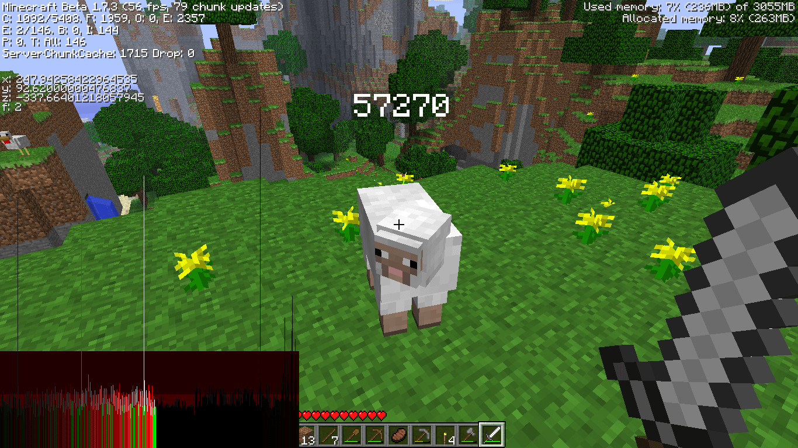
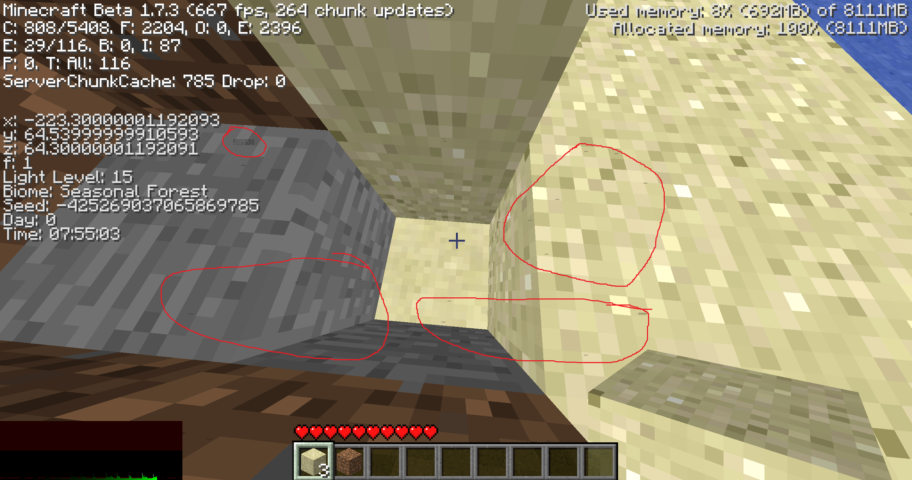

# No More Entity Labels on F3 Beta 1.7.3
This mod removes the entity labels that appear when pressing F3 that labels entities, for example monsters spawning in caves, with a number above their heads. These labels go through walls and can be used as an x-ray exploit, even though there are other genuine reasons to use F3 in-game.

Supports beta 1.7-1.7.3

## Visual example
Using this mod, the number for example 57270 doesn't appear above entities when pressing F3

These numbers can be used as an x-ray/exploit to see caves by seeing the numbers of monsters that spawn below ground. As you can see, there are entity numbers running around underground:

## Why use this mod
You might want to use the F3 menu to get your Y-axis height, your frame rate or to check the light level of the block you are standing on. Now you can do so without accidentally cheating and seeing where all the mobs are.

## If using Optifine
You don't actually need this mod. In settings, under Other, turn Fast Debug Info on. This will also hide the entity labels, and give a less cluttered debug view.
